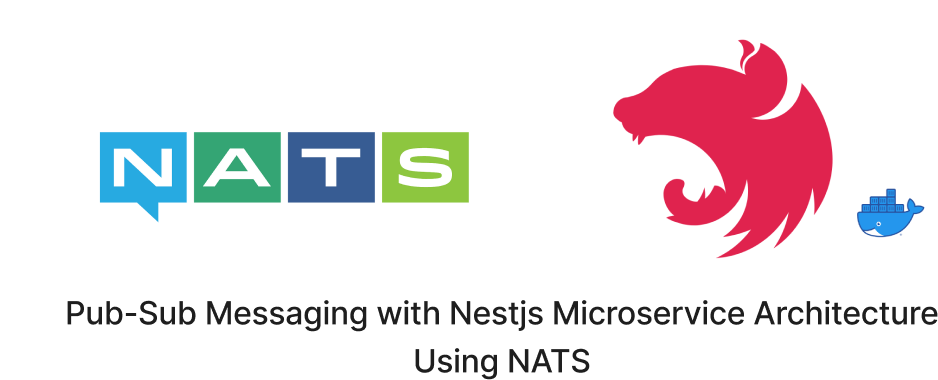

# NATS with NestJS

The Project is about using Nest.js and NATS, focusing on the implementation of a powerful and fast pub-sub system. with principles of microservices, how Nest.js framework can be utilized for building microservices, and the integration of NATS (NATS Streaming or NATS.io) as a messaging system for communication between microservices. Topics covered may include setting up a microservice architecture, implementing communication patterns using NATS for event-driven architecture, handling scalability and fault tolerance, and demonstrating practical examples or use cases. Overall, this project gives practical guidance on leveraging Nest.js and NATS for building robust microservices architectures.

